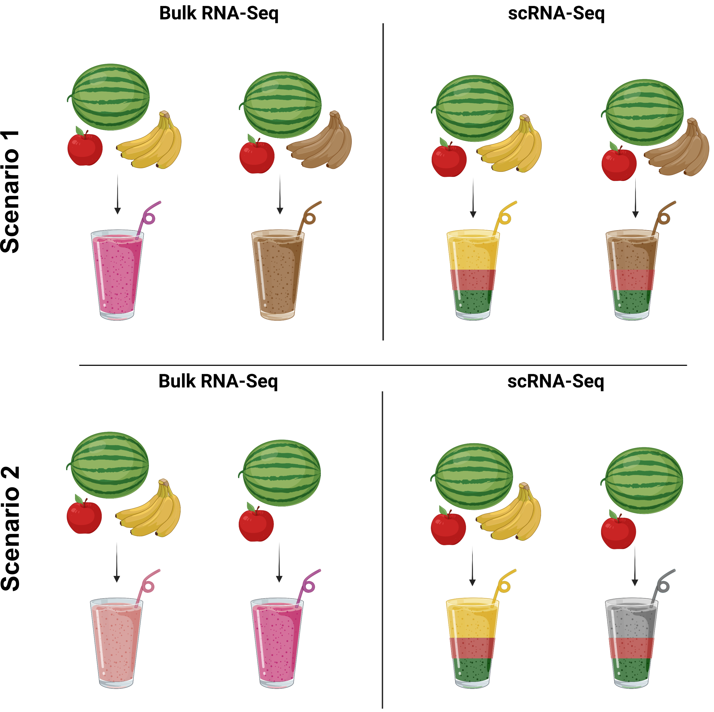
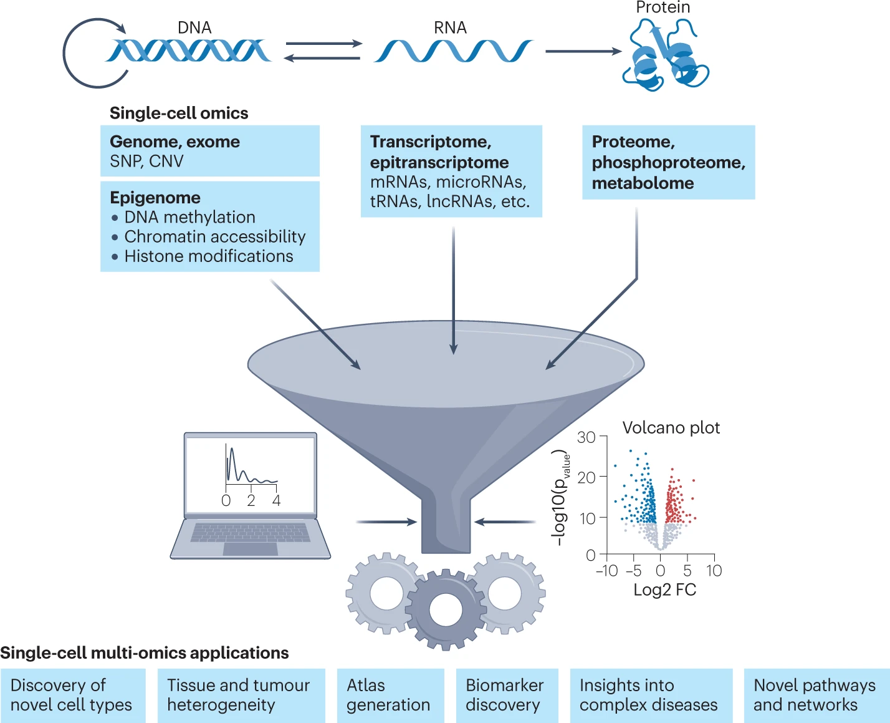
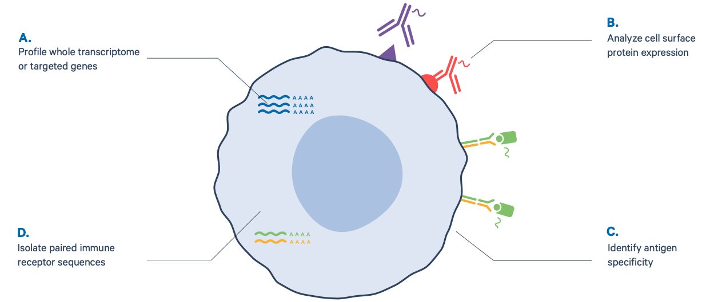
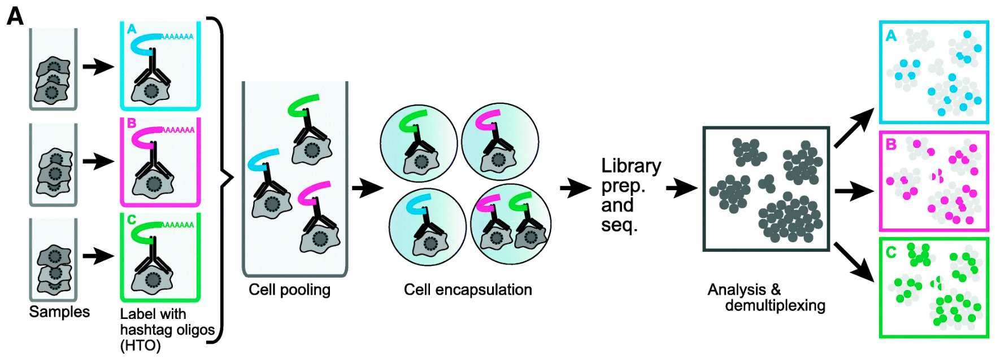

# Introduction to single-cell RNA sequencing

## Why scRNA-seq?

Across human/mouse tissues, there is an incredible diversity of cell types, states, and interactions. To better understand these tissues and the cell types present, single-cell RNA-seq (scRNA-seq) offers a glimpse into what genes are being expressed at the level of individual cells.

_**Image credit:** courtesy of Dr. Ayshwarya Subramanian_

The single-cell RNA-seq (scRNA-seq) offers significant advantages over the bulk RNA-seq approach while investigating heterogeneous populations of cells. Before scRNA-seq, transcriptome analysis was performed using bulk RNA-seq, a straightforward method for comparing the averages of cellular expression. This method can be a good choice if looking at comparative transcriptomics (e.g., samples of the same tissue from different species) and for quantifying expression signatures in disease studies. It also has the potential for discovering disease biomarkers if you are not expecting or concerned about cellular heterogeneity in the sample. Two scenarios where scRNA-seq outperforms bulk RNA-seq are shown below: 

While bulk RNA-seq can explore differences in gene expression between conditions (e.g., treatment or disease), the differences at the cellular level need to be adequately captured. For instance, in the images below, if analyzed in bulk (left), we would not detect the correct association between the expression of gene A and gene B. However, if we properly group the cells by cell type or cell state, we can see the correct correlation between the genes.

_**Image credit:** Trapnell, C. Defining cell types and states with single-cell genomics, Genome Research 2015 (doi:
https://dx.doi.org/10.1101/gr.190595.115)_

This exciting and cutting-edge scRNA-seq method can be used to:

- explore which cell types are present in a tissue
- identify unknown/rare cell types or states
- elucidate the changes in gene expression during differentiation processes or across time or states
- identify genes that are differentially expressed in particular cell types between conditions (e.g., treatment or disease)
- explore changes in expression among a cell type while incorporating spatial, regulatory, and/or protein information

## A single cell multi-omics approach for studying γδ T cells
The introduction of single-cell multi-omics approach (CITE-seq) has presented us with an unprecedented opportunity to unravel the intricacies of Gamma Delta (γδ) T cells, an intriguing subset of T cells with diverse and distinct functions. By integrating single-cell RNA sequencing (scRNA-seq) with other omics technologies such as T-cell receptor (TCR) sequencing, epigenomics, and proteomics, researchers can gain a comprehensive understanding of γδ T cells at a molecular level. This approach enables the simultaneous examination of gene expression patterns, TCR repertoire diversity, chromatin accessibility, and protein expression profiles in individual γδ T cells, providing insights into their developmental trajectories, functional heterogeneity, antigen recognition mechanisms, and intercellular communication. This tutorial will focus on integrating scRNA-seq data with TCR VDJ usage and cell surface protein expression of important markers.

_**Image credit:** Baysoy, A., Bai, Z., Satija, R. et al. The technological landscape and applications of single-cell multi-omics. Nat Rev Mol Cell Biol (2023). https://doi.org/10.1038/s41580-023-00615-w_

Among the different scRNAseq techniques, the droplet-based method, such as the one employed by the 10x Genomics Chromium system, has gained prominence. This method utilizes microfluidic technology to encapsulate individual cells and unique molecular barcodes into droplets, allowing parallel processing of thousands of cells. By combining reverse transcription and amplification within these droplets, 10x Genomics Chromium enables the generation of single-cell transcriptomes. This technique provides a comprehensive view of gene expression patterns across diverse cell populations.

In addition to gene expression profiling, the 10x Genomics Chromium platform offers the unique advantage of enabling simultaneous analysis of cell surface protein expression and immune profiling. By incorporating specific antibody tags and VDJ sequence enrichment primers, this technology allows the detection of cell surface protein expression and TCR VDJ usage per cell. Consequently, researchers can gain insights into the molecular landscape of individual cells and understand their functional diversity. This integrated approach provides a powerful tool for exploring cellular composition, immune response, and heterogeneity within complex biological systems.

_**Image credit:** 10x Genomics Website (https://www.10xgenomics.com/products/single-cell-immune-profiling)_

Cell hashing is a technique used in single-cell RNA sequencing (scRNAseq) experiments to enable multiplexing and sample barcoding. It involves the labeling of individual cells from different samples with unique oligonucleotide tags, known as "hashing barcodes." These barcodes are added to the cells before pooling them together for library preparation and sequencing. By incorporating cell hashing, researchers can simultaneously process and analyze multiple samples within a single scRNAseq experiment. This multiplexing capability is particularly useful when comparing different experimental conditions, time points, or treatment groups. Cell hashing helps reduce batch effects and enables more efficient use of sequencing resources, while still allowing for the identification and characterization of individual cells from each sample in downstream analysis.

## Challenges of scRNA-seq analysis
While scRNA-seq is a powerful and insightful method for the analysis of gene expression with single-cell resolution, there are many challenges and sources of variation that can make the analysis of the data complex or limited. Throughout the analysis of scRNA-seq data, we will try to account for or regress out variation due to the various sources of uninteresting variation in our data.
**Overall, the following is recommended:**

- Do not perform single-cell RNA-seq unless it is necessary for the experimental question of interest. Could you answer the question using bulk sequencing, which is simpler and less costly? Perhaps FACS sorting the samples could allow for bulk analysis?
- Understand the details of the experimental question you wish to address. The recommended library preparation method and analysis workflow can vary based on the specific experiment.
- Avoid technical sources of variability, if possible:
	- Discuss experimental design with experts prior to the initiation of the experiment
	- Isolate RNA from samples at same time 
	- Prepare libraries at same time or alternate sample groups to avoid batch confounding
	- Do not confound sample groups by sex, age, or batch

## Let's analyze a scRNA-seq dataset
To understand and perform scRNA-seq data analysis, let's use a dataset that was generated in a past experiment of Boyson lab.
Please go to the PowerPoint [slide](../slides/experiment_design_howitworks.pptx) to discuss the experiment design and how the sequencing-ready libraries are prepared.

## How scRNA-Seq works: From cell suspension to sequencing-ready libraries 
Depending on the library preparation method used, the RNA sequences (also referred to as reads or tags) will be derived either from the 3' ends (or 5' ends) of the transcripts (10X Genomics, CEL-seq2, Drop-seq, inDrops) or full-length transcripts (Smart-seq). The choice of the method involves the biological question of interest. _Please note: For single-cell immune profiling studies, only the 5’- assay is appropriate.__

The 10X Genomics chromium system performs a single-cell droplet-based encapsulation using a gel bead-in-emulsion (GEM) approach. In the instrument, barcoded gel beads are mixed with cells, enzymes, and partitioning oil forming numerous GEMs. Each GEM acts as a micro-reaction droplet where the gel beads dissolve, and RNA transcripts from each cell get barcoded. The barcoded fragments are pooled, and sequencer–compatible libraries are created. 

 

_**Image credit:** adapted from 10x Genomics brochure_

## A typical single cell RNA-seq analysis workflow
After quantifying gene expression from raw sequencing reads, we need to bring the count matrix data (filtered_feature_bc_matrix) into R to generate metrics for performing QC and further downstream analysis.

 

       
                                             ---------------------------------
                                             -------END of THIS LESSON -------
                                             ---------------------------------